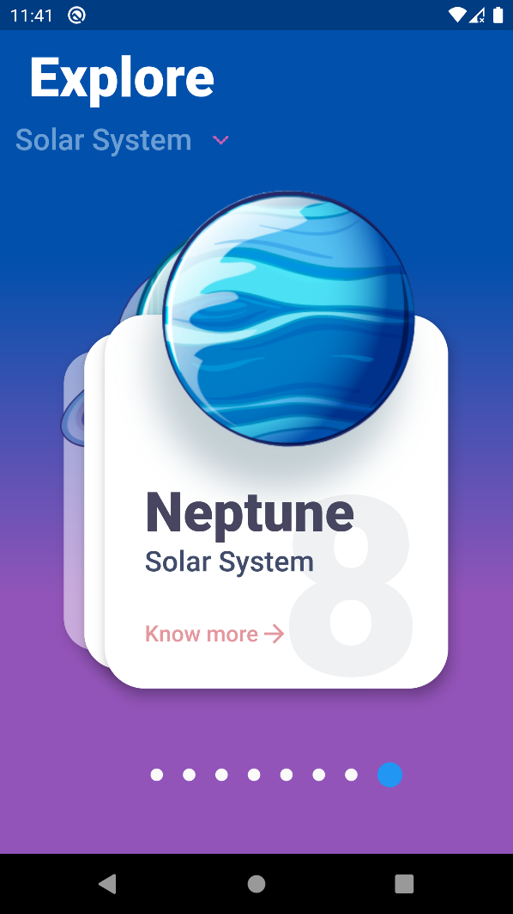

# Universe

------------------------- 
To Infinity and Beyond!!! 
------------------------- 

## About The Project
[According to the wikipedia](https://en.wikipedia.org/wiki/Universe): The universe is all of space and time and their contents, including planets, stars, galaxies, and all other forms of matter and energy. 
The Universe is one of the most interesting and mysterious things in this age of science. 
The aim of this project is to spread the knowledge about the universe and its all mysterious things like planets, solar systems, black holes, galaxies, etc. 
 
In this project, only our planetary which is named as "solar system" information has been added. 
Each of our solar system plantes and their details are stored 
This project is connected with the **Firebase Database** to fetch the details of each planets. 
There is a quiz section of the project where users can participate and test their knowledge, what they learned about the universe. 
The quiz section will be more interactive and user-based in future, **InShaaAllah**. 

### Here are some screenshots of the project:
Home Page:  
 
Home Page (cont.):  
 
Home Page (cont.):  
 
Planetary Details Page:  
 
Planetary Details Page (cont.):  
 
